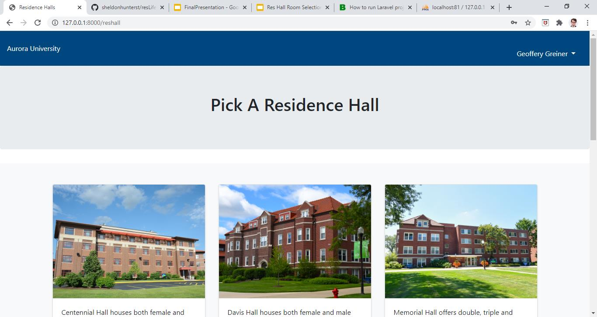

  
  
  

The Resident Life Project was an idea brought to our team by the Resident Life department of Aurora University. Before the beginning of every school year, student who are going to live on campus have to gather on campus to register for a room. They would gather in the auditorium, wait in a single file line and go up to the stage one by one to figure out what room you wanted to choose. Through weekly meetings, several people from the department and my team helped plan and create an application that would streamline that process through AU’s website. And by utilizing Laravel, a php framework, we developed an application that met all of their specifications.

For this project, I was the lead developer, responsible for developing specific backend functionality and the frontend interface. 
I designed the layout of the website using bootstrap and CSS and had to change all of the jpg’s of the floor plans to pdfs. I added in the functionality so that students could choose a room. This includes people actually being assigned rooms in the database. This included making sure people choose the right room assigned to their gender. And I Made sure that a room’s capacity is changed after that process. 

Our clients also wanted to be able to insert people’s user information into the project by xml file. There was a plug in that I utilized that added that information, after I had configured it to work with our project. They also wanted to add in the functionality to have students save rooms for people that they might wish to board with. I added in the functionality for the project to do this and created the necessary views to go with it.

