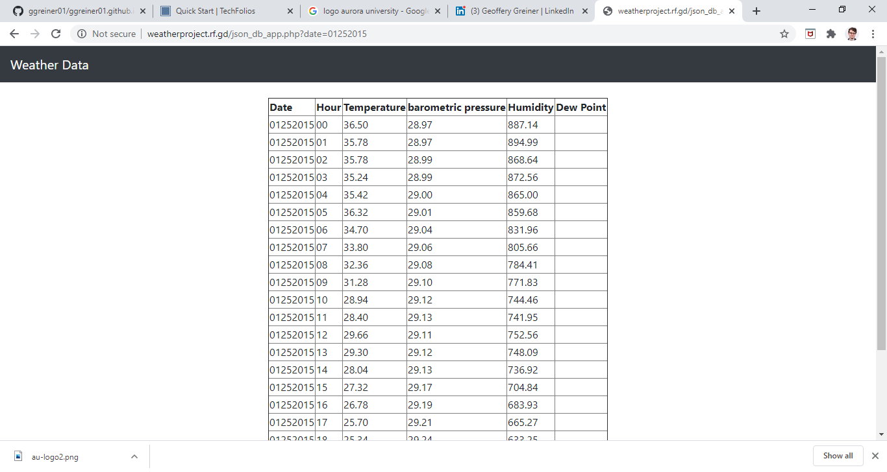
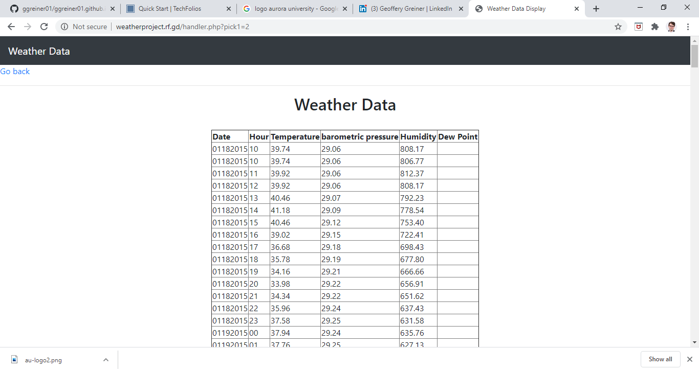

  
  

The Weather Data Project was a collaboration between me and a former professor.  Ex-professor Oij, another retired professor of mine, has a cabin somewhere in Northern Wisconsin.  He keeps records of several different kinds of weather data that he measures every hour on the hour beginning in 2014. All of the data he had was uploaded to a .csv file. What I needed to do was to retrieve that data and insert it into a database as well as incoming data. Then the web page should be able to display that information in JavaScript format. 

First thing was to be able to get the names of the files off of the website where he uploaded the data onto the .csv files.  That way I could get the data from the file to parse it into an array. Then I had to take that array and run the SQL command to insert the data into the database. Then I had to create a JavaScript program that could display all the information for a specific date. After learning JavaScript fairly easily I had to host the program online. I did this through Infinityfree.net, where it is still up and running. 
Use http://weatherproject.rf.gd/Form.php and http://weatherproject.rf.gd/json_form
